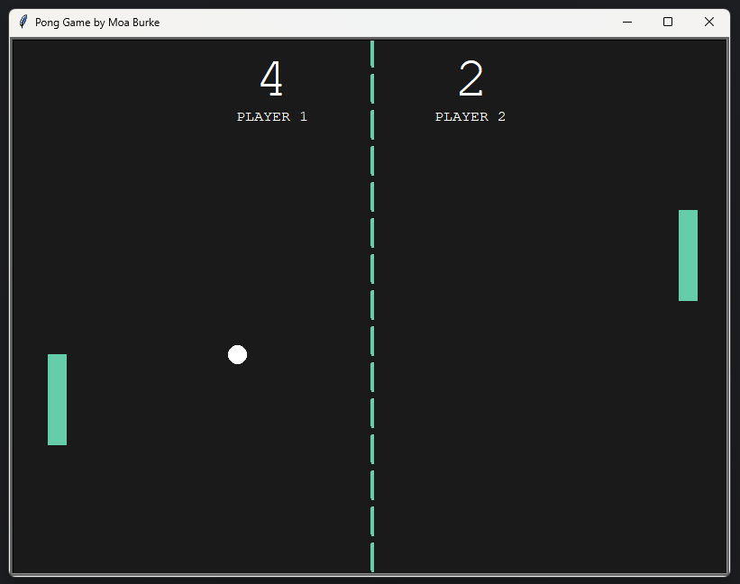
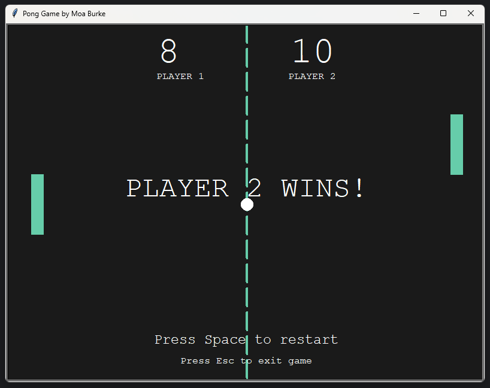

# Pong Game

## Description
This is a simple Pong game implemented using Python's Turtle graphics module. The game allows two players to control paddles and compete to score points by hitting a ball back and forth. The first player to reach the winning score wins the game. The game keeps track of scores anddisplays a winner when a player reaches a specified score.




## Features
### Ball Class
- Handles ball movement across the screen.
- Bounces off the paddles and walls.
- Resets to the center after a point is scored.
- Increases speed after bouncing off a paddle to enhance gameplay.

### Paddle Class
- Allows two players to control paddles.
- Moves up and down within defined boundaries to prevent going off-screen.
- Supports resetting to starting positions when needed.

### Scoreboard Class
- Displays the current score for both players.
- Shows player names at the top of the scoreboard.
- Indicates the winner when a player reaches the winning score.
- Provides messages to restart the game or exit.

## Installation
To run this project, ensure you have Python installed on your computer. You can download Python from [python.org](https://www.python.org/).

### Clone the Repository
```bash
git clone https://github.com/moaburke/PongGame.git
cd PongGame
```

## Usage

1. **Open the Terminal and navigate to project directory.** (Command Prompt or any terminal of your choice).

2. **Run the Game:**
   - Execute the game using the command:
     ```bash
     python main.py
     ```
   - If you receive an error indicating that Python is not recognized, ensure Python is installed and added to your PATH. You can verify by running `python --version`.

3. **Controls:**
   - Control the left paddle using the **W** (up) and **S** (down) keys.
   - Control the right paddle using the **Up Arrow** (up) and **Down Arrow** (down) keys.

4. **Winning the Game:**
   - The first player to reach the winning score (10 points) wins the game.
     
## Game Logic
- The ball resets to the center of the screen after a point is scored.
- Players can restart the game by pressing the **Space bar**.
- The game can be exited by pressing the **Esc key**.

## Code Structure
- **ball.py**: Defines the `Ball` class responsible for handling the ball's movement across the screen, implementing bouncing behavior off paddles and walls, adjusting speed after collisions, and resetting its position after a point is scored.
- **paddle.py**: Defines the `Paddle` class that manages the movement and positioning of the paddles for both players, ensuring they stay within the defined boundaries of the game.
- **scoreboard.py**: Defines the `Scoreboard` class that displays the current scores for both players, shows player names, indicates the winner when a player reaches the winning score, and provides messages for restarting the game or exiting.
- **main.py**: Serves as the main entry point to run the game, integrating all the classes, setting up the game loop, and handling player inputs.
